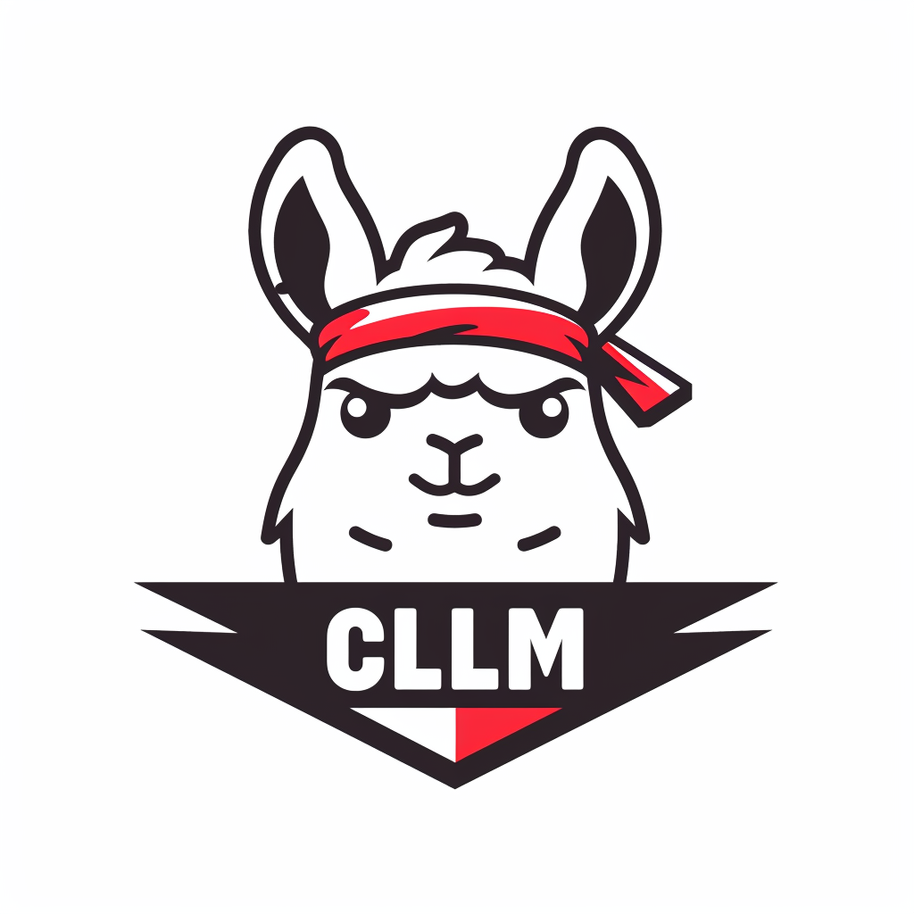
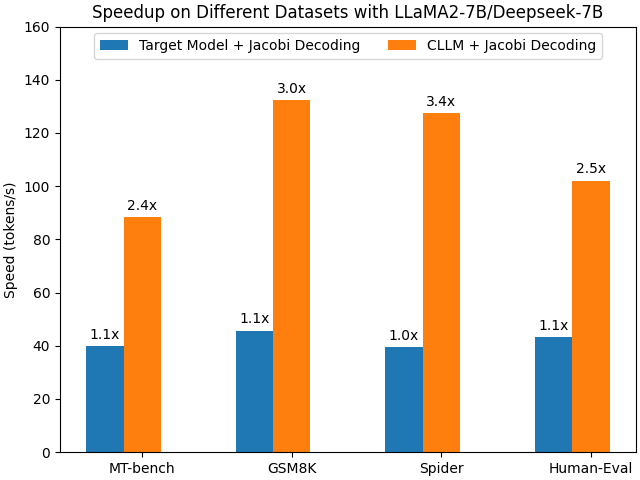
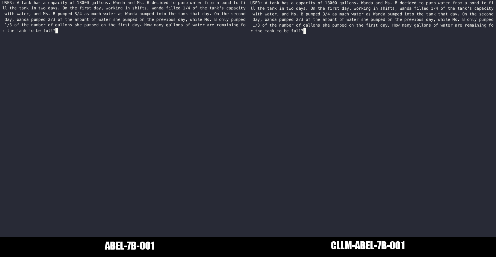

<div align="center"><h1>&nbsp;Consistency Large Language Models: A Family of Efficient Parallel Decoders</h1></div>

<p align="center">
| <a href="http://arxiv.org/abs/2403.00835"><b>Paper</b></a> | <a href="https://hao-ai-lab.github.io/blogs/cllm/"><b>Blog</b></a> |
</p>

<p align="center">
  <a href="https://opensource.org/licenses/Apache-2.0">
    
  </a>
  <a href="https://github.com/hao-ai-lab/Consistency_LLM/issues">
    
  </a>
  <a href="https://github.com/hao-ai-lab/Consistency_LLM/pulls">
    
  </a>
</p>

##

Consistency large language models (CLLMs) is a new family of models capable of reducing inference latency by efficiently decoding $n$ tokens in parallel. This decoding method is called [Jacobi decoding](https://arxiv.org/abs/2305.10427), which improves inference efficiency by breaking the sequential nature of conventional auto-regressive (AR) decoding. CLLMs are trained with the objective of performing efficient Jacobi decoding by mapping any randomly initialized $n$-token sequence to the same result as AR decoding in as few steps as possible.

Experiment results have demonstrated the effectiveness of CLLMs, showing $2.4\times$ to $3.4\times$ improvements in generation speed on a vriety of tasks. 
<p align="center">
  <picture>
  
  </picture>
</p>

A demo of using CLLM to achieve significant improvements ($\sim3\times$) in generation speed to solve a basic math problem is shown below:

<p align="center">
  <picture>
  
  </picture>
</p>

## Contents
- [News](#news)
- [Introduction](#introduction)
- [Installation](#installation)
- [Model Weights](#model-weights)
- [Usage](#usage)
  - [Inference](#inference)
  - [Training](#training)
  - [Evaluation](#evaluation)
- [Citation](#citation)

## News 🔥

- [2024/2] CLLM Paper now available on [arXiv](http://arxiv.org/abs/2403.00835). CLLMs model checkpoints are released on [Huggingface Hub](https://huggingface.co/cllm).

## Introduction
Consistency Large Language Models (CLLMs) is a family of efficient parallel decoders refined from target LLMs.

Compared with existing fast decoding techniques, CLLMs achieve fast parallel decoding **without the need for**:
- Draft models
- Architectural modifications/auxiliary model components

This introduces a number of advantages for CLLMs:
- CLLMs don't have to deal with the complexity of obtaining 'good' draft models and managing two different models in a single system.
- CLLMs share the same architecture with target LLMs and require no additional engineering efforts when adopting the technique to different models.
- CLLMs can be integrated seamlessly with other techniques for efficient LLM inference (e.g. Lookahead Decoding) to achieve even more significant speedup.

## Installation
1. Environment setup:
```
conda create -n cllm python=3.10
conda activate cllm
```
2. Clone this repository and build from source:
```
git clone git@github.com:hao-ai-lab/Consistency_LLM.git
cd Consistency_LLM
```
3. Install dependency:
```
pip install -r requirements.txt
pip install flash-attn==2.4.1
```
## Model Weights
#### Target Pre-trained Models

| Size | Dataset |  Hugging Face Repo                             |
| ---- | -------- | --------------------------------------------- | 
| 7B   | ShareGPT |  [cllm/vicuna-7b-sharegpt-gpt4-48k](https://huggingface.co/cllm/vicuna-7b-sharegpt-gpt4-48k)   |
| 7B  | GSM8K | [GAIR/Abel-7B-001](https://huggingface.co/GAIR/Abel-7B-001) |
| 7B  | Spider | [cllm/deepseekcoder-7b-instruct-spider](https://huggingface.co/cllm/deepseekcoder-7b-instruct-spider) |
| 7B  | Code-Search-Net Python | [cllm/deepseekcoder_7b_codesearch_net_python](https://huggingface.co/cllm/deepseekcoder_7b_codesearch_net_python) |

#### CLLMs
| Size | Dataset |  Hugging Face Repo                             |
| ---- | -------- | --------------------------------------------- | 
| 7B   | ShareGPT |  [cllm/consistency-llm-7b-sharegpt48k](https://huggingface.co/cllm/consistency-llm-7b-sharegpt48k)   |
| 7B  | GSM8K | [cllm/consistency-llm-7b-gsm8k](https://huggingface.co/cllm/consistency-llm-7b-gsm8k) |
| 7B  | Spider | [cllm/consistency-llm-7b-spider](https://huggingface.co/cllm/consistency-llm-7b-spider) |
| 7B  | Code-Search-Net Python | [cllm/consistency-llm-7b-codesearchnet](https://huggingface.co/cllm/consistency-llm-7b-codesearchnet) |

## Usage
### Inference 
```
bash applications/run_chat_cllm.sh {model_path} {cllm_type}
```
`cllm_type` can take the value of `spider`, `python`, `gsm8k`, `sharegpt`.

### Training
1. Collect Jacobi trajectory:
- Method 1: Directly download Jacobi trajectory in hugging face to `data/collected_jacobi_trajectory/` from [our Huggingface Hub page](https://huggingface.co/cllm).
- Method 2 (Generate trajectory suitable to your own target model and dataset): Download raw dataset ([Spider](https://huggingface.co/datasets/cllm/spider), [GSM8K](https://github.com/openai/grade-school-math/tree/master/grade_school_math/data/train.jsonl) and [ShareGPT](https://huggingface.co/datasets/anon8231489123/ShareGPT_Vicuna_unfiltered/blob/main/ShareGPT_V3_unfiltered_cleaned_split_no_imsorry.json) are required to be installed in `data/raw_data`). Then run `scripts/generate_trajectory.sh` and the training dataset for a CLLM will be saved in  `data/collected_jacobi_trajectory/`.

For example, for the gsm8k dataset, run:
```
# max_new_tokens corresponds to the size of n_token_sequence
CUDA_VISIBLE_DEVICES=0 bash scripts/generate_trajectory.sh {filename} {model_path} {max_new_tokens} {max_new_seq_len}
```
##### Other command options
```
--filename: path to the raw dataset, currently supporting {spider, code_search_net, data/raw_data/gsm8k_train.jsonl, data/raw_data/ShareGPT_V3_unfiltered_cleaned_split.json} \ 
--data_size: maximum number of prompts used to extract Jacobi trajectories \ 
--use_aug: use data augmentation technique \
--use_labels: add dataset's labels to the output file
```

2. Train a CLLM:
```
bash scripts/train_cllm.sh {model_path} {trajectory_file} {output_path} {n_token_seq_size}
```

### Evaluation
We follow the same settings in [human-eval](https://github.com/openai/human-eval), [Spider](https://github.com/taoyds/spider), [MT-bench](https://github.com/lm-sys/FastChat/tree/main/fastchat/llm_judge) and [GSM8K](https://github.com/openai/grade-school-math) evaluate CLLMs' generation quality. An example code to evaluate CLLMs' throughput measured in tokens/s, fast-forwarded token count, stationary token count can be found in `eval` folder. Take GSM8K dataset as an example, run:
```
CUDA_VISIBLE_DEVICES=0 bash eval/gsm8k/speedup.sh {model_path} {target_model_path} {max_new_tokens}
```
To test accuracy:
```
cd eval/gsm8k
CUDA_VISIBLE_DEVICES=0 acc.py --model_dir {cllm_model_path} --max_new_tokens_for_consistency 16 --temperature 0.0 --top_p 1.0 \
--output_file_name 'cllm_generated_gsm8k.jsonl' --dev_set "gsm8k" --prompt_type math-single --max_tokens 1024 --use_consistency_decoding
```

## Citation
This is the official project repository for the following paper. If you find this repository helpful, Please kindly cite:
```
@misc{kou2024cllms,
      title={CLLMs: Consistency Large Language Models}, 
      author={Siqi Kou and Lanxiang Hu and Zhezhi He and Zhijie Deng and Hao Zhang},
      year={2024},
      eprint={2403.00835},
      archivePrefix={arXiv},
      primaryClass={cs.CL}
}
```
